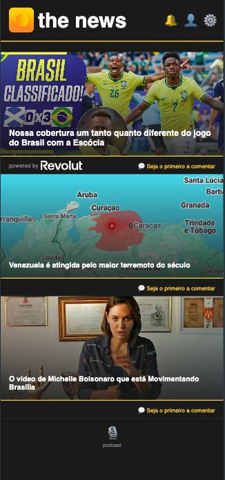
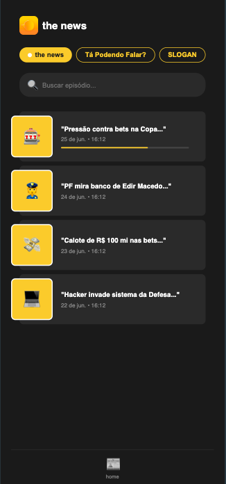

# the news — App Redesign

Case técnico para a vaga de **Front-end Developer & Design** no **the news**, maior newsletter do Brasil com mais de 3 milhões de assinantes.

---

## 📱 Screenshots

| Home | Podcast |
|------|---------|
|  |  |

---

## 🎯 Sobre o projeto

Redesign de duas telas do app do the news com foco em identidade visual, hierarquia de conteúdo e experiência do usuário mobile. O projeto inclui protótipo no Figma criado do zero e implementação em React.

**Problemas identificados no app original:**
- Tela de podcast com fundo branco inconsistente com o tema dark
- Visual genérico sem identidade própria, semelhante ao Spotify
- Tela home desperdiçando espaço com logo e frase inspiracional desconectada do tom da marca
- Lista de matérias sem hierarquia visual

**Soluções implementadas:**
- Tema dark `#1A1A1A` consistente em todas as telas
- Thumbnails dos episódios com emoji temático e efeito bleeding pela borda esquerda do card
- Pills de canal com estado ativo/inativo via styled components
- Home com card principal editorial em destaque e hierarquia visual clara
- Patrocinador integrado de forma contextual, sem banner intrusivo
- CTA de comunidade "Seja o primeiro a comentar" em todas as matérias

---

## 🛠 Stack

- **React** — biblioteca de UI
- **Vite** — bundler
- **Styled Components** — estilização com tema centralizado
- **Yarn** — gerenciador de pacotes
- **Figma** — prototipagem (projeto criado do zero)

---

## 📐 Decisões técnicas

**Separação de responsabilidades**
Cada tela possui dois arquivos: `.js` com os styled components e `.jsx` com a lógica e estrutura do componente. Facilita manutenção e escalabilidade.

**Tema centralizado**
Todas as cores e fontes vivem no `GlobalStyles.js` via `ThemeProvider`. Um rebrand ou a adição de light mode não exige alterações nos componentes.

**Patrocinadores rotativos**
O patrocinador ativo é selecionado via `Math.random()` a cada carregamento. A arquitetura está preparada para substituição por uma API que controle o hall de patrocinadores — basta trocar o array estático por um fetch.

**Dados preparados para API**
Os arrays `articles` e `episodes` são estáticos para fins de protótipo. Em produção, viriam de uma API — o jornalista publica no CMS e o componente renderiza o que recebe, sem alteração de código.

**Navegação via useState**
Navegação entre telas implementada via `useState` no `App.jsx`, sem dependência de router externo para o protótipo. Preparado para migração para `react-router-dom` em um app completo.

**Mobile first**
O projeto foi pensado e desenvolvido para mobile, com dimensões baseadas em iPhone 14 Pro Max (430px).

---

## 🚀 Como rodar localmente

```bash
# Clone o repositório
git clone https://github.com/seu-usuario/the-news-app.git

# Entre na pasta
cd the-news-app

# Instale as dependências
yarn install

# Rode o projeto
yarn dev
```

Acesse `http://localhost:5173` no browser.

---

## 🎨 Identidade visual

| Token | Valor |
|-------|-------|
| Background | `#1A1A1A` |
| Card | `#2A2A2A` |
| Amarelo | `#F5C842` |
| Branco | `#FFFFFF` |
| Cinza | `#888888` |

---

Desenvolvido por **Victor de Luna Freire**